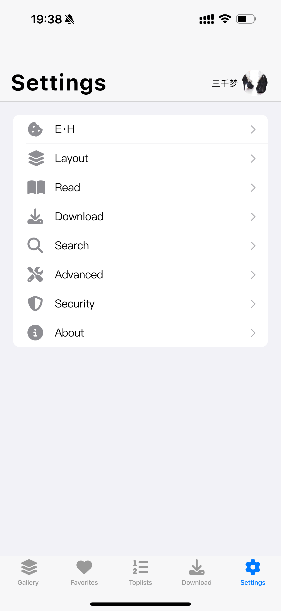
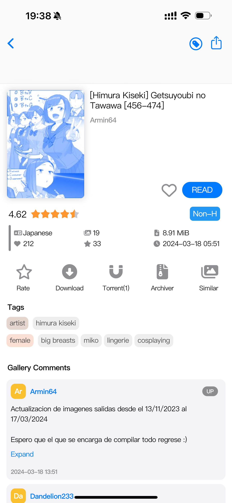
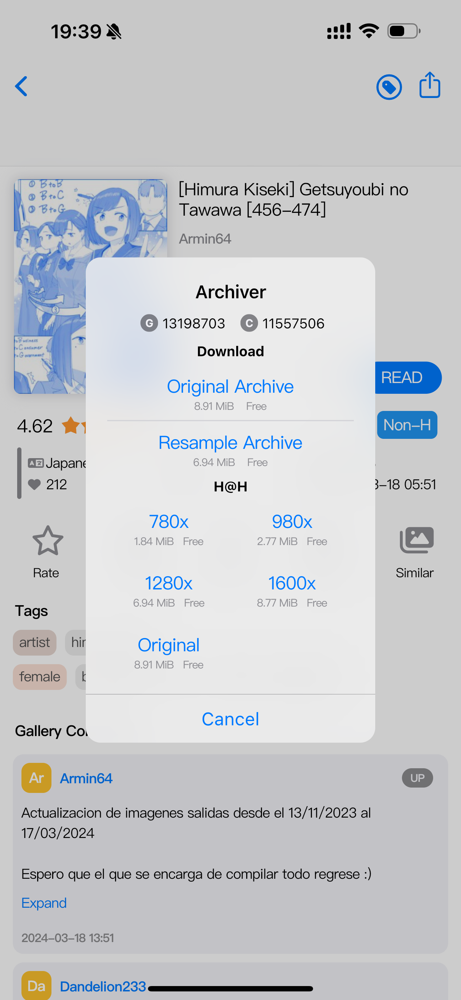
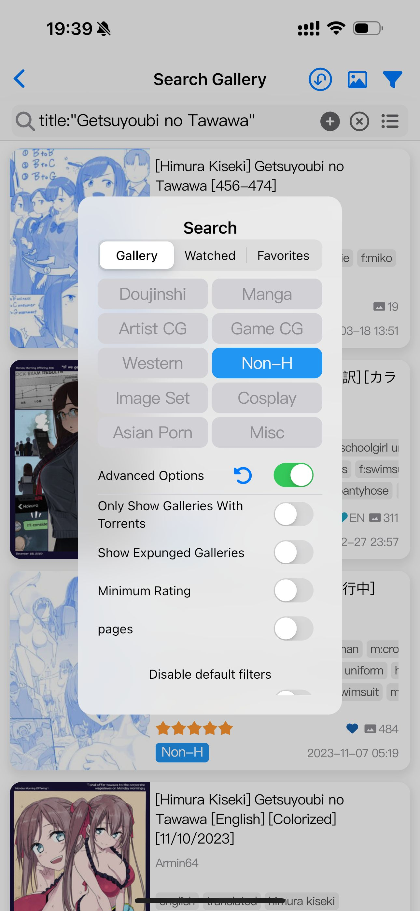
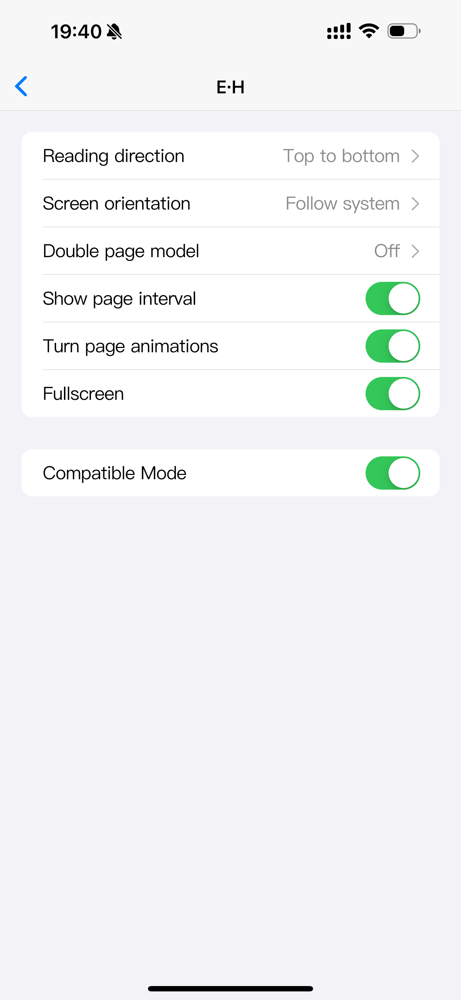

# Eros-FE
[English](https://github.com/3003h/blob/master/README.md) | 简体中文

## 应用简介

一个 flutter 编写的 e-hentai app

## iOS 安装
1. 下载最新 ipa 文件 [Releases](https://github.com/3003h/Eros-FE/releases/latest).
2. 使用 [AltStore](https://altstore.io) 之类的 app 安装到设备上. 或者直接使用 [AltStore.json](https://config-feh.vercel.app/AltStore.json)

## 说明

UI 方面主要参考的[E-HentaiViewer](https://github.com/kayanouriko/E-HentaiViewer)

## 问题

**滑动掉帧**

- 一部分是flutter问题，一部分是开发水平问题，只能说尽力优化

## 感谢

应用借鉴和参考以下项目的部分代码和逻辑进行开发

- [E-HentaiViewer](https://github.com/kayanouriko/E-HentaiViewer)
- [EhViewer](https://github.com/seven332/EhViewer)

ehentai译文数据库

- [EhTagTranslation/Database](https://github.com/EhTagTranslation/Database)

翻译
- [KeepSOBP](https://github.com/KeepSOBP) -- 韩语翻译
- [pursel](https://github.com/pursel), [Gigas002](https://github.com/Gigas002) -- 俄语翻译
- [cristal-node](https://github.com/cristal-node) -- 日语翻译

## 应用截图

### 主页列表

### 设置

### 画廊

  

### 搜索

 

### 阅读

 

## 功能

- [x] 热门,关注,主页,收藏
- [x] 自定义分组，组合多种条件，分组独立样式
- [x] 列表视图,瀑布流视图,网格视图等切换
- [x] 浅色深色模式
- [x] 画廊信息查看
- [x] 图片浏览
- [x] 自动翻页
- [x] 里站表站切换
- [x] 搜索，高级搜索，图片文件搜索
- [x] 标签翻译，自动匹配标签搜索
- [x] 用户登录
- [x] 缓存优化
- [x] 高级设置
- [x] 生物认证锁定
- [x] 发表评论，对评论赞和踩，评论翻译
- [x] 评论显示论坛头像，快速@回复(带锚点)，自动显示引用评论
- [x] EH设置，同步网站
- [x] Mytag设置，编辑关注、隐藏、颜色、权重等。长按Tag快速设置
- [x] 下载，下载原图，归档包下载，直接阅读已下载
- [x] WebDAV同步历史，快速搜索，阅读进度，分组配置
- [x] 可屏蔽带二维码的图片。可标记广告图片，记录pHash值，后续屏蔽相似图片

## TODO

## 依赖项目/插件（部分）

- 网络 [dio](https://pub.dev/packages/dio)
- 状态管理 [getx](https://pub.dev/packages/get)
- 数据库 [sqflite](https://pub.dev/packages/sqflite)
- 持久化 [shared_preferences](https://pub.dev/packages/shared_preferences)
- 国际化 [intl](https://pub.dev/packages/intl)
- 图片 [cached_network_image](https://pub.dev/packages/cached_network_image)、[extended_image](https://pub.dev/packages/extended_image)

## 编译相关

如果需要自行编译的话 \
复制 `lib/config.dart.sample` 为 `lib/config/config.dart` \
复制 `lib/firebase_options_sample.dart` 为 `lib/firebase_options.dart`
